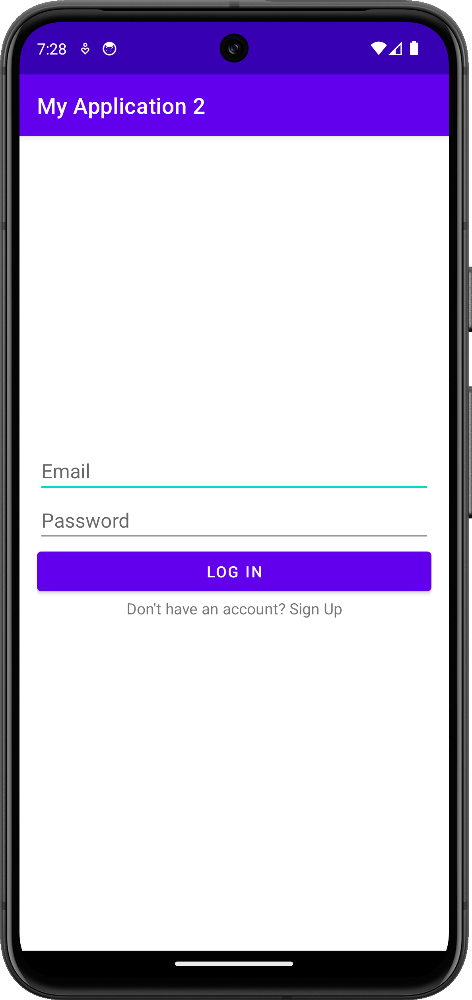
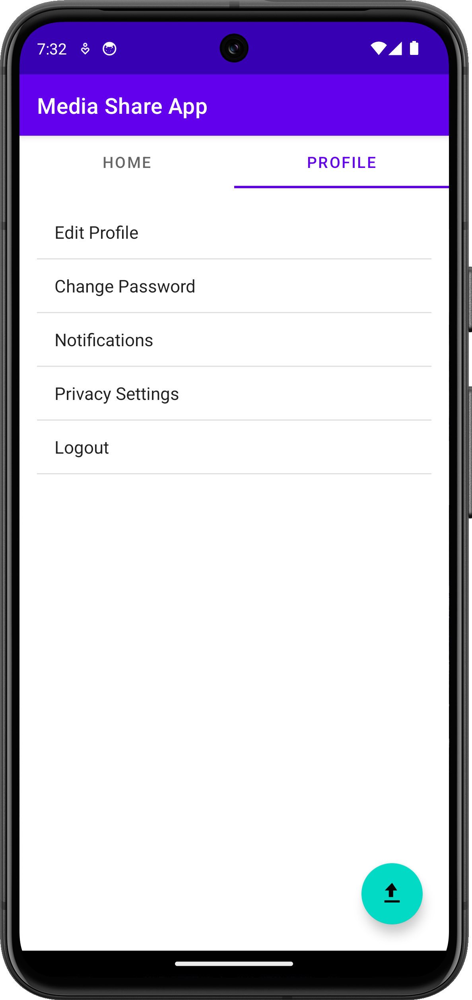
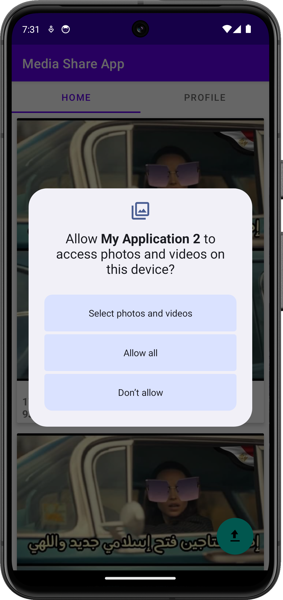
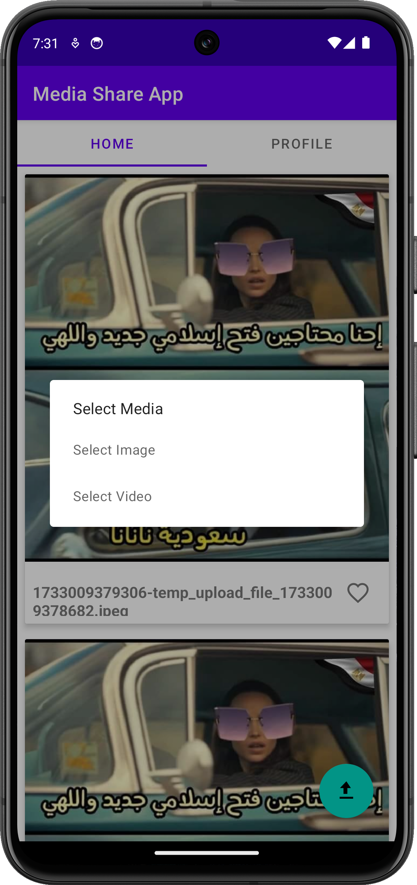

# A brief app intro

A Nativ Android application for a media sharing platform allows users to upload images or videos, view a list of
all images and videos, and like/unlike them. The app consumes a RESTful API to perform these operations.

## Features

-   Authentication
-   Upload images or videos
-   View a list of all images and videos
-   Like/unlike images and videos

## Technologies

-   Kotlin
-   Retrofit
-   Glide

## Installation

1. Clone the repository
2. Open the project in Android Studio
3. Run the project on an emulator or physical device
4. Enjoy the app!

## API

The app consumes a RESTful API to perform operations. The API documentation can be found [here](https://github.com/aabaza97/MSWE-Assignment)

## Screenshots

## Screenshots

| Screenshot 1                              | Screenshot 2                        | Screenshot 3                          |
| ----------------------------------------- | ----------------------------------- | ------------------------------------- |
|        |   |  |
| Screenshot 4                              | Screenshot 5                        |                                       |
|  |  |                                       |

## Considerations

-   The app is still in development and may contain bugs, the main focus was to get the basic functionality working.
-   The app is not optimized for tablets or larger screens.
-   Not all best practices were followed, as the main focus was to get the basic functionality working(AGIAIN).
-   The shall have a unified experience with its iOS counterpart, which is still in development.
